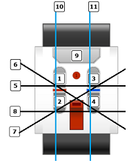

### LeGo Mindstorms

##### ·项目描述

LeGo Mindstorms是一套基于LeGo-Ev3机器人套件且依托于leJOS平台所开发的Java机器人项目。 

##### ·关于机器人

可以根据自己的兴趣设计机器人，或者亦可通过Lego官网获取Ev3机器人图纸。

##### ·开发环境搭建

请严格选择以下工具 >  

	1.MINDSTORMS-EV3：请安装乐高官方发布的‘MINDSTORMS-EV3’程序以确保相关驱动正常。 	
	2.Java7：务必安装Java7(JDK)因为Ev3的程序构建仅支持Java7。 
	3.Eclipse：请尽量安装低版本的Eclipse否则leJOS的插件也许不兼容(目前了解到的Eclipse2021-6之前的版本都支持)。 
	4.leJOS：请前往sourceforge下载，并将它解压到TF卡上。 
	5.最后，提醒就是尽量使用Eclipse 因为leJOS插件有非常好的日志拍错机制，否则你在Ev3上看日志，估计要眼睛都要瞎。 

##### ·API文档

	|-com.zhangyibin
	|	*(注意点：安全气囊一定开辟一条独立的线程作作为安全监控单元)
	|	|-Starter.java(程序开始入口，通过开辟线程来控制各个模块.)
	|	|-arms(武器/手臂)
	|	| 	|-Launcher.java(启动器)
	|	| 	|	|-getLauncherRun() [描述：启动发射装置方法主要是对控制“中型电机”作示例。]
	|	|-information(Ev3屏幕消息显示)
	|	| 	|-PageInformation.java(Ev3屏幕信息)
	|	| 	|	|-getWelcomeToEv3() [描述：程序启动时所显示的软件版本和欢迎语信息。]
	|	| 	|	|-getGoodBye() [描述：程序启关闭所显示的再见信息。]
	|	|-measure(容量计算)
	|	|	|-PowerMonitoring.java(电池容量)
	|	|	|	|-getBatteryCapacityRun() [描述：电池容量检测。]
	|	|	|-Sensitometry.java(感光检测)
	|	|	|	|-getSensitometryRun() [描述：用于检测环境光线值，主要是程序对颜色传感器的控制作示例。]
	|	|-mood(表情)
	|	|	|-EV3LED.java(Ev3Led灯)
	|	|	|	|-setEv3Led(int ledPattern) [描述：用于控制Ev3的Led灯光；参数ledPattern(0-关闭、1-绿、2-红、3-橙)]
	|	|	|-FacialExpression.java(情绪枚举类)
	|	|	|	|-getExpressionEnum() [描述：已枚举出“欢迎、再见、版本、感动、开心、伤心、生气”灯机器人的情绪表达内容。]
	|	|	|-PhotoAlbum.java(Ev3屏幕打印照片)
	|	|	|	|-getIMG_2235() [描述：根据已转成字节的图片信息在Ev3的屏幕上进行输出。]
	|	|	|	|-getIMG_2377() [描述：根据已转成字节的图片信息在Ev3的屏幕上进行输出。]
	|	|	|-Voice.java(Ev3的声音定义)
	|	|	|	|-getBeep() [描述：蜂鸣1次]
	|	|	|	|-getTwoBeeps() [描述：蜂鸣2次]
	|	|	|	|-getSystemSound(boolean aQueued, int aCode) [描述：播放系统声音(此方法没有研究透彻，不建议使用)]
	|	|-power(动力控制)
	|	|	* 动力控制中“战斗模式”是后续机器人开发最有价值的内容。
	|	|	|-AutomaticMode.java(自动模式-未开发)
	|	|	|-CombatMode.java(战斗模式)
	|	|	|	|-getTokenBoolean() [描述：限用于战斗模式中终止程序的信标]
	|	|	|	|-getCombatModeRun() [描述：通过整合中大型电机、颜色传感器、红外传感器、远程红外信标等所设计的“机器人战斗模式”。]
	|	|	|-PowerInterface.java [描述：定义电机转速、时间间隔等机械参数。]
	|	|	|-RunningMode.java (跑步模式)
	|	|	|	|-getRunningModeRun() [描述：通过整合中大型电机、颜色传感器、红外传感器、远程红外信标等所设计的“机器人跑步模式”。]
	|	|	|-WalkingMode.java(走路模式)
	|	|	|	|-getWalkingModeRun() [描述：通过整合中大型电机、颜色传感器、红外传感器、远程红外信标等所设计的“机器人走路模式”。]
	|	|-robot(机器人)
	|	|	* jeff机器人事实上是“动力控制-战斗模式”的改良版本，让程序更佳适合是“逗猫”，这也是现实中对电影《芬奇-2021》最好的现实诠释。
	|	|	|-Jeff.java(机器人“杰夫”)
	|	|	|	|-getTokenBoolean() [描述：限用于战斗模式中终止程序的信标]
	|	|	|	|-getJeffFunnyCatModel() [通过整合中大型电机、颜色传感器、红外传感器、远程红外信标等所设计的“jeff机器人”。]
	|	|-securitycenter(安全中心)
	|	|	* Ev3开发中实际中必须引用的控制方法；（这是我在Ev3开发过程中自认为最重要的经验积累。）
	|	|	｜-getAirbags() [描述：1.当发生系统死循环时，按下触摸传感器(安全气囊)可以退出程序。 2.亦可当成正常的系统关闭按钮使用。]
	

##### ·开发资料

1.电机端口：**  
	
	电机控制：
		C端口->> 左
		B端口->> 右
		A端口->> 中型电机
	
2.信标占用端口：**  
	
<table border ="1">
	<tr>
		<td>跑步模式</td>
		<td>半自动模式</td>
		<td>走路模式</td>
		<td>武器系统</td>
	</tr>
	<tr>
		<td>
			1>前进； 
			3>后退； 
			9>停止； 
			2>左； 
			4>右； 
			5&8>重置电机转速； 
		</td>
		<td>	
			1>前进； 
			3>后退； 
			9>停止； 
			2>左； 
			4>右； 
		</td>
		<td>	
			1>前进； 
			3>后退； 
			9>停止； 
			2>左； 
			4>右； 
		</td>
		<td>	
			6>启动发射装置(中型电机) 
		</td>
	</tr>
</table>		

3.遥控器(远程红外信标)使用说明：  

	信道标号定义表：
		0 = 无按钮（并且“信标”模式关闭）
		1 = 按钮 1
		2 = 按钮 2
		3 = 按钮 3
		4 = 按钮 4
		5 = 按钮 1 和按钮 3 同时
		6 = 按钮 1 和按钮 4 同时
		7 = 按钮 2 和按钮 3 同时
		8 = 按钮 2 和按钮 4 同时
		9 =“信标”模式开启
		10 = 按钮 1 和按钮 2 同时
		11 = 按钮 3 和按钮 4 同时
				

